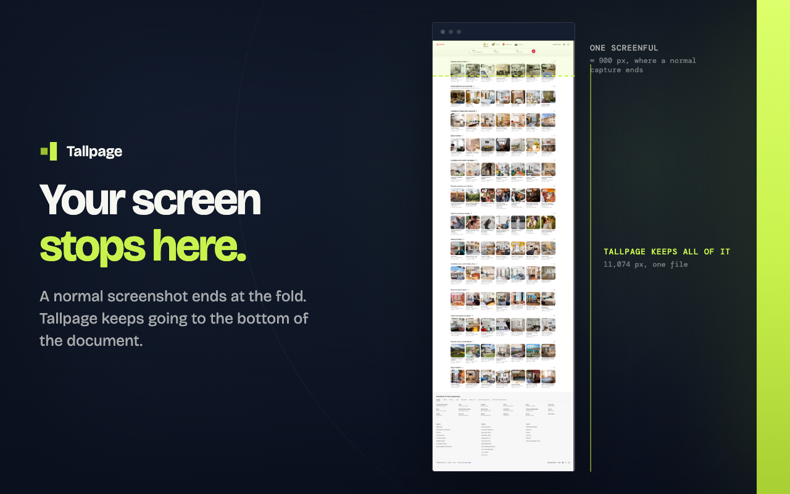

<div align="center">
  
</div>

<p align="center"><strong>Export any page, top to bottom, as PNG, PDF, HTML, or Markdown.</strong></p>

<p align="center">
  <a href="https://github.com/ElecTreeFrying/tallpage/actions/workflows/ci.yml"></a>
  <a href="LICENSE"></a>
</p>

<p align="center"><a href="#install">Install</a> • <a href="#usage">Usage</a> • <a href="#how-it-works">How it works</a> • <a href="#permissions">Permissions</a> • <a href="#limits">Limits</a></p>

---

Tallpage exports the selected page from top to bottom as PNG, PDF, HTML, or Markdown. Chrome's capture is viewport-only, print-to-PDF reflows the document, and scrolling tools can repeat sticky headers or miss lazy-loaded content. Tallpage asks Chrome to render the whole document once: no scrolling, no stitching, no upload.


## The four exports

| Format   | What it is                                                      | What it is not                                      |
| -------- | --------------------------------------------------------------- | --------------------------------------------------- |
| PNG      | Chrome's full-page renderer output, saved unchanged             | A set of stitched viewport screenshots              |
| PDF      | The same visual capture in a single-page PDF                    | A reflowed print layout or selectable-text PDF      |
| HTML     | The current DOM saved as an inert, portable snapshot            | A live copy of the site or a script-enabled web app |
| Markdown | Readable headings, text, links, lists, quotes, code, and tables | A visual copy of the page                           |

## Install

Install [Tallpage from the Chrome Web Store](https://chromewebstore.google.com/detail/tallpage/abgocdacacoomfalabibpmokidccfjej), confirm Chrome's permission prompt, and pin it to the toolbar if you want one-click access. Tallpage supports Chrome and other Chromium-based browsers; Firefox does not provide the capture capability it uses.

## Usage

1. Open the page you want to export.
2. Open Tallpage from the toolbar.
3. Select **PNG**, **PDF**, **HTML**, or **Markdown**.
4. Use **Progress panel** to follow the export after the popup closes.

Every export downloads. **Open downloaded files in a new tab** is enabled by default and can be changed in Options. After a PNG completes, **Copy latest PNG path** in the popup and **Copy PNG file path** in the side panel copy its absolute local path for tools that can read local files; browser chats still need the image uploaded or pasted.

## How it works



```text
popup click
     ↓
background   →  debugger.attach
     ↓
             →  Page.getLayoutMetrics             document size in CSS pixels
     ↓
             →  Emulation.setDeviceMetricsOverride  viewport := the whole document
     ↓                                              wait, re-measure, correct once if changed
             →  Page.captureScreenshot            one render, no tiling
     ↓
             →  Emulation.clearDeviceMetricsOverride

HTML and Markdown take the other branch — no resize, no paint:
             →  Runtime.evaluate                  serialize the live DOM or
                                                  extract readable content
PNG  the protocol's bytes, untouched
PDF  decode → strip alpha → CompressionStream → pdf.ts
     ↓
             →  data: URL → chrome.downloads → debugger.detach
```

Scroll-and-stitch on `tabs.captureVisibleTab` was tried and abandoned. It sees only the viewport, so a full-page result has to guess how to handle sticky and fixed elements, scroll-triggered reveals, lazy images, and late-injected page chrome. Each fails on a different site, and Chrome limits that API to two captures per second. Tallpage instead resizes the renderer to the document and paints once.

## Permissions

| Permission  | Why Tallpage uses it                                                                             |
| ----------- | ------------------------------------------------------------------------------------------------ |
| `debugger`  | Temporarily measures, captures, or serializes the selected page through Chrome DevTools Protocol |
| `activeTab` | Reads the selected tab's title and URL after Tallpage is opened                                  |
| `downloads` | Saves the requested file and resolves a completed PNG's path when asked                          |
| `storage`   | Keeps the open-after-download preference and browser-session export status                       |
| `sidePanel` | Shows progress and the current or most recent export after the popup closes                      |

**`debugger` is the expensive one and it is deliberate.** It cannot be made optional, it warns
_"Read and change all your data on all websites"_ at install, and Chrome shows an
undismissable banner while attached. It can also make Chrome Web Store review deeper and
slower. That is the price of asking Chrome's renderer for a full-page result instead of
simulating one by scrolling and stitching.

Tallpage has no persistent host permissions, no content script, no analytics, no account, and no server. Page content and local PNG paths stay on the device; see the [privacy policy](PRIVACY.md).

## Limits

| Limit                   | Behavior                                                                                                                                                   |
| ----------------------- | ---------------------------------------------------------------------------------------------------------------------------------------------------------- |
| Protected pages         | Chrome pages, extension pages, DevTools, and other protected URLs cannot be exported                                                                       |
| Fixed-position elements | They appear once at the position where the full-page render begins                                                                                         |
| 16,384px raster cap     | PNG and PDF reduce pixel density when either raster axis would exceed the cap; the document is not cropped                                                 |
| PDF text                | PDF is a visual snapshot, so its text is not selectable or searchable                                                                                      |
| HTML behavior           | Scripts, frames, inline event handlers, active forms, and redirects are removed; inaccessible or oversized assets may remain linked to their original URLs |
| File-URL access         | Downloads work without it, but opening PNG, PDF, or HTML automatically requires **Allow access to file URLs** in Chrome's extension settings               |

## Links

- [Watch the demo](https://www.youtube.com/watch?v=Bixfo2iODDY)
- [Contributing](.github/CONTRIBUTING.md)
- [Security policy](.github/SECURITY.md)
- [Code of Conduct](.github/CODE_OF_CONDUCT.md)
- [Privacy policy](PRIVACY.md)
- [Issues](https://github.com/ElecTreeFrying/tallpage/issues)

## License

Tallpage is available under the [MIT License](LICENSE).
