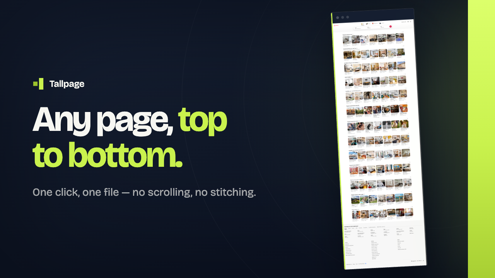
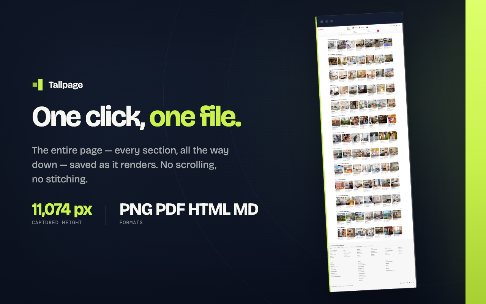

<div align="center">
  
</div>

<div align="center"><strong>Save any webpage, top to bottom, as an image, a PDF, an offline copy, or plain text.</strong></div>

<div align="center">
  <a href="https://chromewebstore.google.com/detail/tallpage/EXTENSION_ID"></a>
  <a href="https://www.youtube.com/watch?v=Bixfo2iODDY"></a>
</div>

<div align="center">
  <a href="https://github.com/ElecTreeFrying/tallpage/actions/workflows/ci.yml"></a>
  <a href="LICENSE"></a>
</div>

<div align="center"><a href="#what-you-get">What you get</a> • <a href="#what-people-use-it-for">Use cases</a> • <a href="#install">Install</a> • <a href="#how-to-use-it">How to use it</a> • <a href="#why-not-just-take-a-screenshot">Why not a screenshot</a> • <a href="#about-that-chrome-warning">The Chrome warning</a></div>

---

Open a page. Click one button. The whole thing — every section, all the way to the bottom — lands in your Downloads folder as one file.

No scrolling. No stitching pieces together. Nothing gets uploaded anywhere.

<div align="center">
  <a href="https://www.youtube.com/watch?v=Bixfo2iODDY">
    
  </a>
  <br>
  <sub><a href="https://www.youtube.com/watch?v=Bixfo2iODDY">▶ Watch the demo</a></sub>
</div>

## What you get

Four buttons, four kinds of file. Pick whichever suits what you're doing.

**PNG** — a picture of the entire page, exactly as it looks. Use it when the appearance is the point.

**PDF** — the same picture, in a document you can attach to an email, print, or drop into a folder.

**HTML** — an offline copy of the page you can open later without internet. Text stays text, links stay links, and the images come along with it.

**Markdown** — just the words. Headings, paragraphs, lists, links, tables — with the navigation, ads, and styling stripped away.

The first two are what the page *looks* like. HTML is what the page *is*. Markdown is what the page *says*. They're different things, not four versions of the same file.

## What people use it for

**Receipts and confirmations.** Booking pages, order summaries, and invoices that give you no print button and no download link. One click, one PDF.

**Saving something before it disappears.** Articles get edited, listings get taken down, pages move behind paywalls. Save the version you actually read.

**Showing someone what you're seeing.** Reporting a problem, asking for help, sending a page to a colleague — the whole page in one image beats four screenshots and an explanation.

**Reading later, without the noise.** Markdown gives you a long article as plain text you can read anywhere, with the pop-ups and sidebars gone.

**Moving notes and content around.** Markdown drops straight into Obsidian, Notion, Apple Notes, or wherever you keep things.

**Design and layout reference.** Study a full page — how it's spaced, what order the sections come in, where it ends — instead of piecing it together from screenshots.

**Working with AI tools.** Paste a page's Markdown into ChatGPT or Claude instead of a link, and the model gets the actual content without wasting space on menus and cookie banners. If you use Codex or Claude Code, Tallpage can copy a saved image's file path straight to your clipboard.

## Install

**[Get Tallpage on the Chrome Web Store →](https://chromewebstore.google.com/detail/tallpage/EXTENSION_ID)**

Click **Add to Chrome**, confirm the permission prompt, and Tallpage appears in your toolbar. Nothing else to set up — no account, no sign-in, no configuration.

Works in Chrome, Edge, Brave, Opera, and other Chrome-based browsers. Firefox isn't supported.

If Chrome's permission prompt gives you pause, [here's exactly what it means](#about-that-chrome-warning).

## How to use it

1. Open the page you want to save.
2. Click Tallpage in your toolbar.
3. Pick **PNG**, **PDF**, **HTML**, or **Markdown**.

That's it. The file downloads, and by default it also opens in a new tab so you can check it. If you'd rather it just download quietly, turn off **Open downloaded files in a new tab** in the options.

A few things worth knowing:

- **The popup closes right away.** That's normal — the capture keeps running in the background, and the file arrives whether the popup is open or not.
- **Long pages take a few seconds.** Click **Progress panel** if you want to watch it, or check what the last export was after the fact.
- **After saving a PNG**, there's a button to copy its file path to your clipboard — handy if you're pasting it into a tool that reads local files.

## Why not just take a screenshot?

Because a screenshot stops at the bottom of your screen, and the page usually doesn't.



**Chrome's own screenshot tool** only captures what's currently visible. On a long page that's maybe 5% of it.

**Print to PDF** changes the layout. Pages use a completely separate design for printing, so what you get is a different-looking document — reflowed columns, missing images, dropped backgrounds.

**Other full-page tools** scroll down the page, take a photo every screenful, and glue the results together. It mostly works, until it doesn't:

- Headers that stick to the top of your screen get photographed once per screenful, so they repeat down the image
- Images that load as you scroll often come out blank
- Animations that trigger on scroll get caught halfway
- Chat widgets and cookie banners appear over and over

Tallpage doesn't scroll at all. It stretches the page to its full height and asks Chrome to draw the whole thing in one go — so there's nothing to glue together and nothing to guess at.

|                             | Tallpage | Scroll-and-stitch tools | Chrome's screenshot |
| --------------------------- | -------- | ----------------------- | ------------------- |
| Captures the whole page     | Yes      | Yes                     | No                  |
| Repeated headers            | No       | Common                  | —                   |
| Blank lazy-loaded images    | No       | Common                  | —                   |
| Saves text and offline copy | Yes      | Rarely                  | No                  |
| Sends your page anywhere    | Never    | Depends on the tool     | Never               |

## About that Chrome warning

When you install Tallpage, Chrome warns you it can **"Read and change all your data on all websites."** That sounds alarming, so here's what's actually going on.

Chrome has exactly one way to capture a full page: the same interface its developer tools use. That interface is powerful, so Chrome shows its strongest warning for anything that touches it — there's no narrower option to ask for, and no way to say "this extension only takes screenshots."

You'll also see a **"Tallpage started debugging this browser"** bar while an export is running. Chrome shows that automatically and it can't be dismissed. It disappears when the export finishes.

What Tallpage actually does with it: reads the page you're currently looking at, only after you click one of the four buttons, and lets go the moment the file is saved.

## Your files stay on your computer

Everything happens on your machine. Tallpage has no server, no account, no sign-in, and no analytics. Your pages are never uploaded, and there is no code loaded from anywhere else at runtime.

The only thing it remembers between sessions is whether you want files to open after downloading. Everything else is forgotten when you close your browser.

Full details in the [privacy policy](PRIVACY.md).

## Good to know

A few honest limitations:

- **Chrome's own pages can't be saved.** Settings, the extensions page, and similar built-in pages are off limits to every extension.
- **Floating elements appear once.** Chat bubbles, back-to-top buttons and cookie bars show up in the position they start in, rather than following down the page.
- **Very long pages come out slightly softer.** There's a size ceiling on images, so an extremely tall page is saved at lower detail rather than being cut short. Nothing is ever cropped.
- **PDF text can't be selected or searched.** The PDF is a picture of the page, not a text document.
- **Saved HTML doesn't run.** Interactive parts won't work — it's a snapshot, not a working copy of the site. Some images may still load from the original site when you open it.
- **One Chrome setting for auto-opening.** For saved files to open in a tab, Chrome needs **Allow access to file URLs** enabled for Tallpage, which only you can turn on from `chrome://extensions`. Without it the file still downloads perfectly — it just won't open by itself.
- **Chrome-based browsers only.** Firefox doesn't have the capability Tallpage is built on.

<details>
<summary><strong>For developers</strong></summary>

<br>

Manifest V3, built on [WXT](https://wxt.dev) and Angular, with no third-party runtime code in the capture path. The PDF writer, the compressor, the canvas work and the download all use platform APIs.

**Permissions**

```
debugger  activeTab  downloads  storage  sidePanel        host_permissions: []
```

`debugger` cannot be made optional — it's on Chrome's exception list, so it sits in the manifest at install rather than being requested on a gesture. `activeTab` reads the selected tab's title and URL, `downloads` saves the file and resolves a completed PNG's local path on request, `storage` keeps one preference and browser-session status, and `sidePanel` provides progress after the popup closes. There is no `clipboardWrite` permission — the clipboard write runs inside the button's own user gesture.

**The capture pipeline**

```
popup click
     ↓
background   →  debugger.attach
     ↓
             →  Page.getLayoutMetrics             document size in CSS pixels
     ↓
             →  Emulation.setDeviceMetricsOverride  viewport := the whole document
     ↓                                              wait, re-measure, correct once if changed
             →  Page.captureScreenshot            one render, no tiling
     ↓
             →  Emulation.clearDeviceMetricsOverride

HTML and Markdown take the other branch — no resize, no paint:
             →  Runtime.evaluate                  serialize the live DOM or
                                                  extract readable content
PNG  the protocol's bytes, untouched
PDF  decode → strip alpha → CompressionStream → pdf.ts
     ↓
             →  data: URL → chrome.downloads → debugger.detach
```

The resize is the mechanism. `captureBeyondViewport: true` used alone is the obvious wrong turn — it requests pixels past the viewport edge without the renderer knowing the viewport grew, so the compositor tiles the same screenful down the whole image.

Scroll-and-stitch on `tabs.captureVisibleTab` was tried and rejected on evidence. That API sees only the viewport, and `MAX_CAPTURE_VISIBLE_TAB_CALLS_PER_SECOND` is 2, so an 11,000px page took twelve seconds to produce the wrong answer.

There is no persistent content script. The HTML and Markdown serializers run through the already-attached debugger session only for the export you asked for; they read the DOM and change nothing.

**Building from source**

```bash
git clone https://github.com/ElecTreeFrying/tallpage.git
cd tallpage
npm install
npm run dev            # Chrome with hot reload
npm run build          # production → .output/chrome-mv3/
```

Load `.output/chrome-mv3/` at `chrome://extensions` with Developer mode on.

`npm run format:check`, `npm run compile`, `npm test`, `npm run build` and `npm run zip` all pass before a release package is considered ready.

</details>

## Links

- [Watch the demo](https://www.youtube.com/watch?v=Bixfo2iODDY)
- [Report an issue](https://github.com/ElecTreeFrying/tallpage/issues)
- [Privacy policy](PRIVACY.md)
- [Contributing](.github/CONTRIBUTING.md)
- [Security policy](.github/SECURITY.md)

## License

Tallpage is available under the [MIT License](LICENSE).